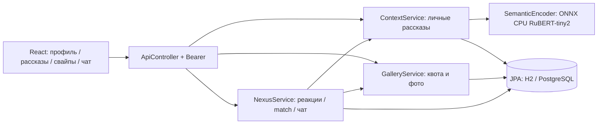

# Архитектура Nexus

React + TypeScript → REST Spring Boot / Spring Security → JPA / H2 либо PostgreSQL. Vite и nginx проксируют /api; единый демонстрационный JAR содержит собранный React. Java 21, Spring Boot 3.5.16.

SemanticEncoder использует фиксированные веса RuBERT-tiny2, cased WordPiece, CLS pooling и L2. Каждый блок до 254 токенов + CLS/SEP; вектор рассказа — нормализованное среднее блоков с весом их длины, пользователя — нормализованное среднее рассказов. Размерность 312. Кэш в БД включает версию модели; при смене версии вектор пересчитывается. Исходный текст и вектор выдаются только там, где это разрешено: тексты — только автору, векторы — никогда через API. Подробнее [MODEL.md](MODEL.md).

Рекомендации исключают себя, профили без четырёх свойств/контекста, неподходящий возраст и уже обработанные анкеты. Ранжирование: cosine ↓, userId ↑. Общие публичные темы отображаются отдельно и не влияют на score. Новый круг сбрасывает только собственные Skip под блокировкой пользователя, если непросмотренные закончились и существуют подходящие пропущенные.

GalleryService выдаёт только первые N фото, где N — число своих снимков, максимум шесть. Короткоживущий случайный access-ticket на изображение привязан к смотрящему, ID и версии снимка; при каждом GET повторно проверяются текущая квота и позиция. URL действует 15 минут, отзыв при выходе; private,no-store. Такие URL являются временными ссылками доступа: намеренно переданную ссылку нельзя считать защитой от копирования. Загруженные JPEG и исходные рассказы хранятся в БД, не шифруются отдельно; администратор БД имеет доступ. Защита от участников обеспечивается API, не обещанием шифрования.

Однократная GalleryMigration переносит прежний аватар; флаг galleryMigrated предотвращает восстановление удалённых фото при перезапуске. DemoData дополняет только недостающие демонстрационные данные. Исходные столбцы аватара сохраняются для совместимости.

Пароли BCrypt, сессионные токены хешируются; API не использует cookies для авторизации. Сессии вкладок изолированы через sessionStorage. Match и связанные уведомления создаются транзакционно с канонической парой и блокировкой. Сообщения опрашиваются каждые 2 секунды, уведомления каждые 7.

Docker использует glibc JRE: ONNX Runtime не рассчитан на musl Alpine. Веса скачиваются на этапе сборки с проверкой SHA-256; во время работы сеть для ML не нужна. Нативная память модели добавляется к Java heap. При отсутствии модели сохранение рассказа сообщает 503, система не подменяет NLP совпадением тегов.

Ограничения: полный перебор кандидатов и галерей, хранение изображений в БД, Hibernate ddl-auto=update вместо версионированных миграций, временные media-ticket в памяти процесса, без горизонтального масштабирования. Для учебного локального прототипа; до публичного запуска нужны миграции, модерация, HTTPS, лимиты и политика удаления.
