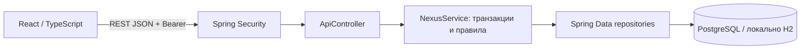

# Архитектура текущего прототипа

Frontend обращается к относительному `/api/v1`. При разработке Vite проксирует его на localhost:8080; в Docker nginx проксирует на backend:8080. Можно включить собранный frontend в JAR и использовать один порт 8080.

## Профиль-свойства
Вместо отдельной сущности Profile используется ProfileProperty: userId, name, value, visible. Пара (userId, name) уникальна. Значения типизируются и проверяются сервисом по разрешённым именам: display_name, bio, birth_date, city. JSON-контракт использует `visible`, что соответствует `public` на замечании преподавателя. Неограниченный EAV не вводится: новые свойства требуют явной серверной валидации.

Сервис формирует публичный DTO, исключая скрытые свойства; сущности пользователей/сессий наружу не сериализуются. Интересы публичны. Interest хранит справочник, UserInterest — выбор участника, Preference — возрастные настройки. UserInterest и Preference имеют связи JPA с внешними ключами. Остальные внутренние ссылки пока представлены ID; целостность операций обеспечивает сервис, удаления нет.

`ru.nexus.Interests` задаёт исходные 12 названий для CatalogueData. API читает справочник из таблицы interests. CatalogueData выполняется перед DemoData и переносит старые интересы/настройки без удаления исходных данных. DemoData одной транзакцией создаёт недостающие аккаунты и исправляет незаполненные демоанкеты.

Режим `local` задаёт драйвер H2 и файловую БД; `postgres` задаёт драйвер PostgreSQL и параметры соединения. Compose явно выбирает postgres, отдельный compose.h2.yaml — local с volume. Backend проходит healthcheck до запуска nginx.

## Подбор
score = число общих интересов / число различных интересов двух пользователей. Это измерение пересечения, не вероятность успеха знакомства. История учитывается исключением like/skip. По явной кнопке можно сбросить только свои Skip и снова увидеть подходящие пропущенные анкеты; Like остаются исключёнными. ML-модели и embeddings отсутствуют. Фильтр возраста односторонний: используются настройки запрашивающего пользователя.

## Совпадения и сообщения
Реакция блокирует обе строки пользователей в порядке возрастания ID. После записи проверяется обратный like; пара хранится как firstId < secondId. Match и уведомления создаются в той же транзакции. Любое чтение/сообщение проверяет участие в match. Сообщения неизменяемы в текущем API.

## Сессии
Opaque Bearer вместо JWT: случайный токен 32 байта, в базе SHA-256 и срок действия. Проверка в фильтре Spring Security и сервисе; logout удаляет запись. Подпись и секрет JWT не требуются. Периодическая очистка просроченных строк — задача развития.

Старые PNG показывают первоначальный проект и не являются схемой текущего кода. Актуальные диаграммы — `diagrams/ERD.md` и `diagrams/UML.md`.
