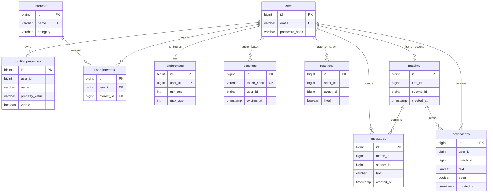

# Актуальная логическая ERD

В новой базе 10 предметных/служебных таблиц, каждая соответствует JPA-сущности. Уникальны email, имя интереса, preferences.user_id, пары profile_properties(user_id,name), user_interests(user_id,interest_id), reactions(actor_id,target_id), matches(first_id,second_id).

UserInterest имеет физические FK к UserAccount и Interest, Preference — FK к UserAccount. Остальные связи представлены ID и проверяются сервисом; удаления сущностей в API нет. Перед добавлением удаления нужны полные FK и политика каскадов.

В ранее созданной базе могут остаться старые user_account_interests и users.min_age/max_age. CatalogueData переносит их значения в новые сущности; старые данные сохраняются для восстановления и не являются текущей моделью. Profile, Photo, EmbeddingVector и Recommendation как таблицы отсутствуют.

