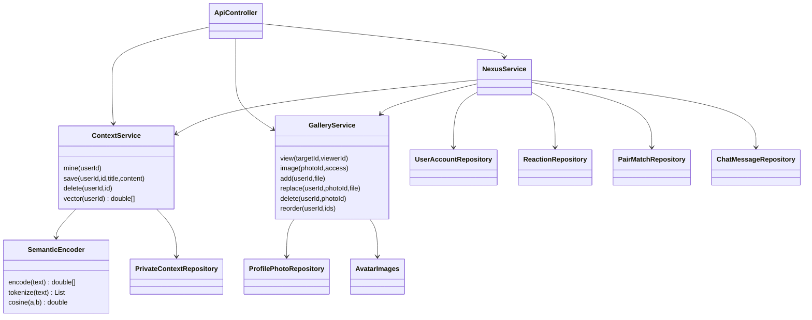

# UML текущего прототипа

Сущности и связи показаны в ERD.md. На клиенте App управляет маршрутом/сессией, ContextEditor — собственными рассказами, PhotoUpload — галереей владельца, PhotoGallery — только разрешёнными кадрами кандидата, SwipeDeck — жестом и состоянием реакции. api.ts добавляет Bearer к JSON/multipart-запросам; браузер загружает изображения по временным access-URL без сессионного токена в адресе.
