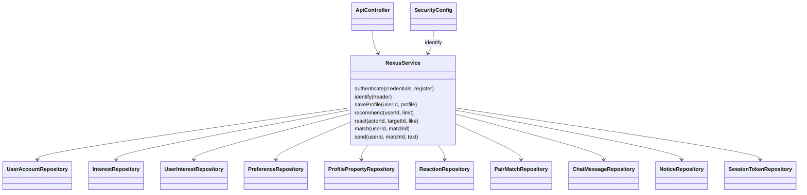

# Основные классы

DTO Requests отделяет входные данные от JPA-сущностей. Публичный профиль проецируется сервисом с учётом visible. Общий транзакционный сервис выбран для небольшого прототипа; выделение Auth/Profile/Recommendation/Chat сервисов — направление развития.
